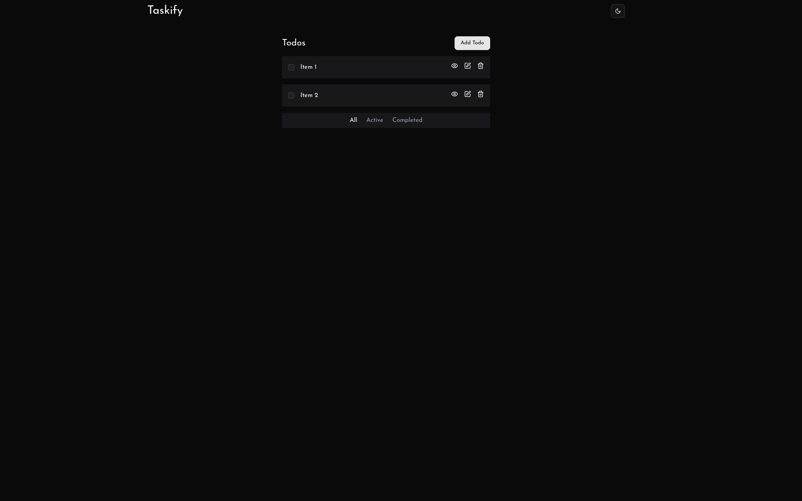

# Taskify - A minimalist todo list application

## Table of contents

- [Overview](#overview)
  - [Screenshot](#screenshot)
  - [Links](#links)
- [My process](#my-process)
  - [Built with](#built-with)
  - [Continued development](#continued-development)
- [Author](#author)

## Overview

### Screenshot

### Links

- Github URL: [https://github.com/krutagna31/taskify](https://github.com/krutagna31/taskify)
- Live Site URL: [https://taskify-31.vercel.app](https://taskify-31.vercel.app)

## My process

### Built with

- Next.js
- Typescript
- Tailwind CSS
- Shadcn/UI
- React Hook Form
- Zod

### Continued development

Use this section to outline areas that you want to continue focusing on in future projects. These could be concepts you're still not completely comfortable with or techniques you found useful that you want to refine and perfect.

**Note: Delete this note and the content within this section and replace with your own plans for continued development.**

### Useful resources

## Author

- Website - [Add your name here](https://www.your-site.com)
- Frontend Mentor - [@yourusername](https://www.frontendmentor.io/profile/yourusername)
- Twitter - [@yourusername](https://www.twitter.com/yourusername)
